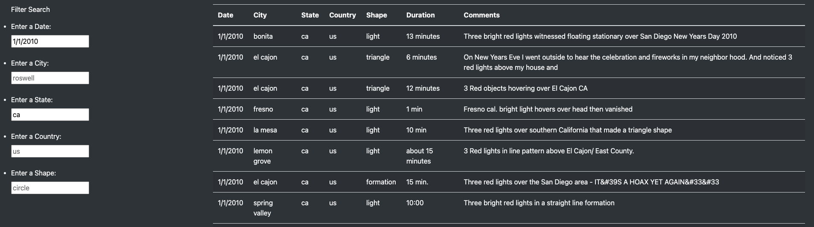
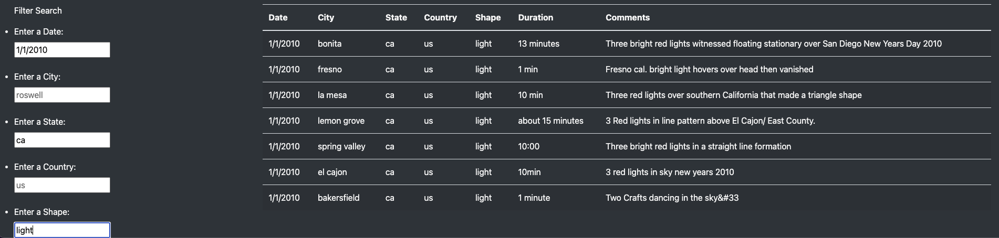

# UFOs

## Overview

The purpose of this analysis was to create a webpage and dynamic table that has the ability to be filtered on multiple criteria at the same time. Data on UFO sightings was displayed using JavaScript, HTML and CSS. 

## Results

This webpage can be used to filter UFO sighting criteria based on the following criteria: the data the event occurred, the city it was in, state, country and finally the shape of the actual UFO. 
For example, let's say that you were in California in 2010 on New Years Day. You could filter your search of UFO sightings for both state and date at once, as can be seen in the image below: 

Furthermore, say that you had an experience on this date in California in which you believed you saw a UFO that had the shape of just pure light, you could refine your search even further as can be seen below: 

It is easy to see the utility of this new dynamic webpage! 

## Summary

One drawback to this new design is that when filtering, the filters need to be an exact match and that means the text is case-sensitive. For example, if I filter the shape by "light" vs. "Light" I get two completely different answers (results back vs. no results back as in the latter there are no matches). 

Therefore, I would recommend for future usage to expand on the filter parameters to include partial matches. I would also recommend that if no results were found, to return a message box indicating that this is the case as at the current state of the webpage the table will be empty if no matches are found and the end-user might not understand why! 